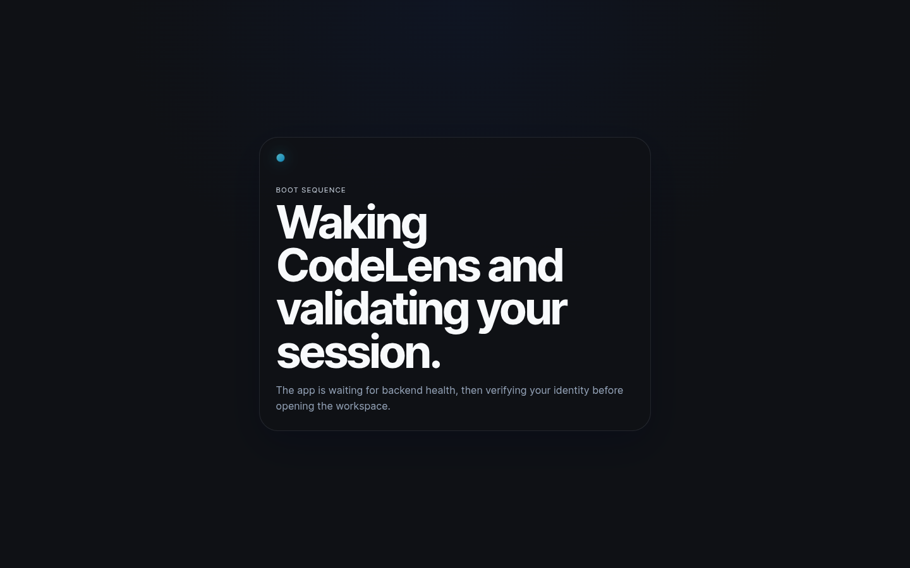
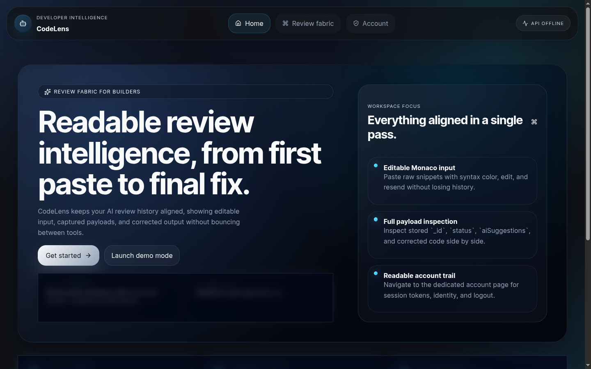
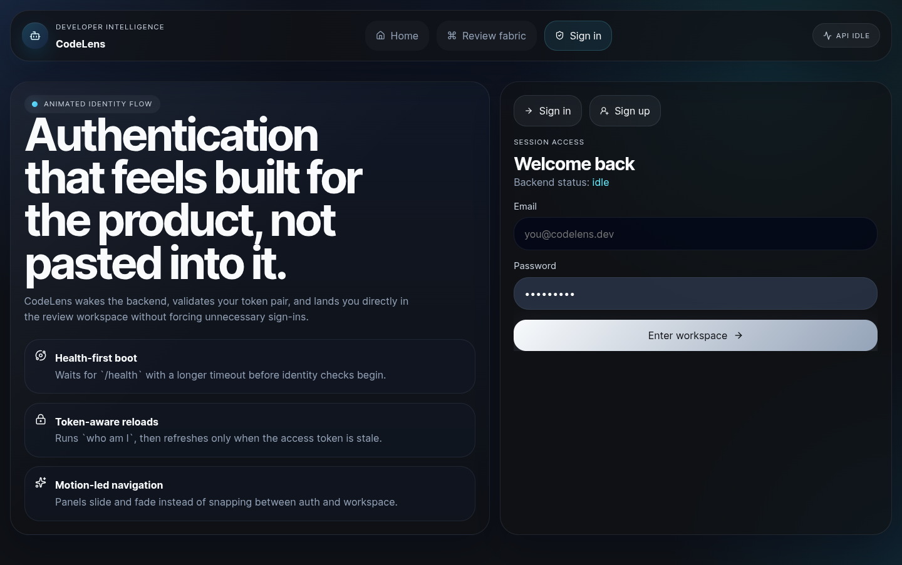
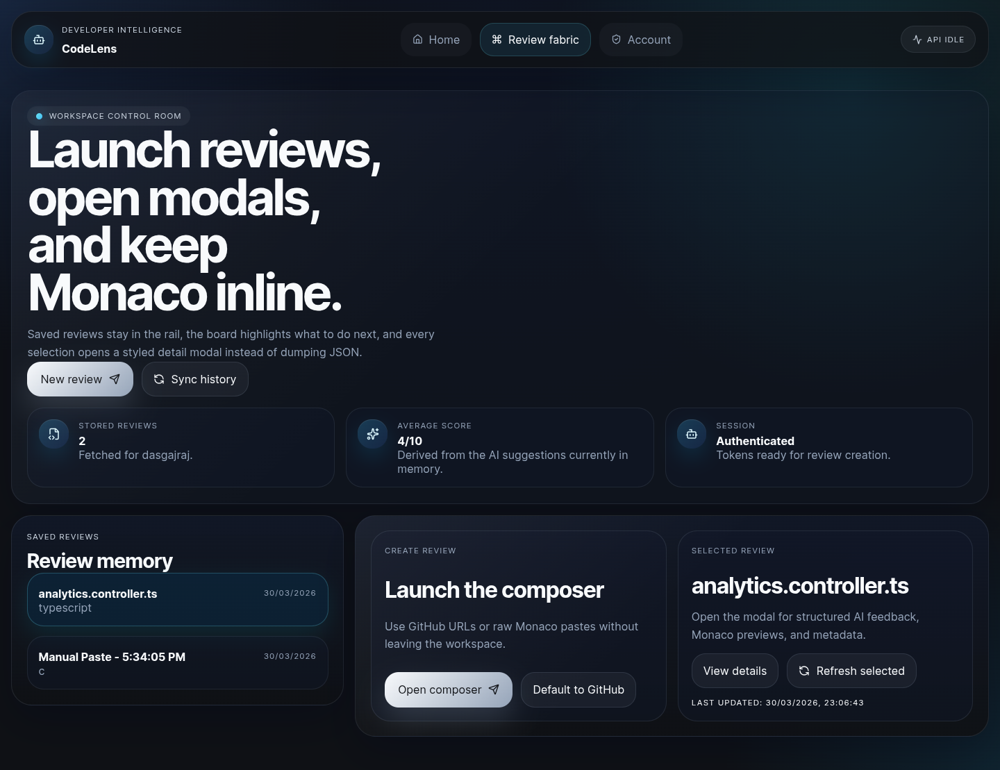
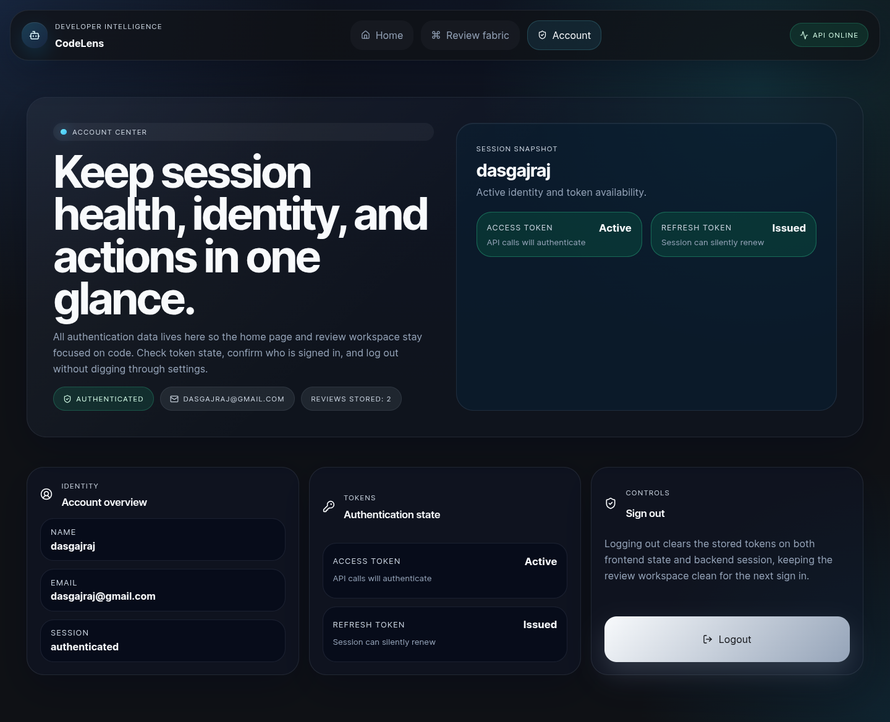
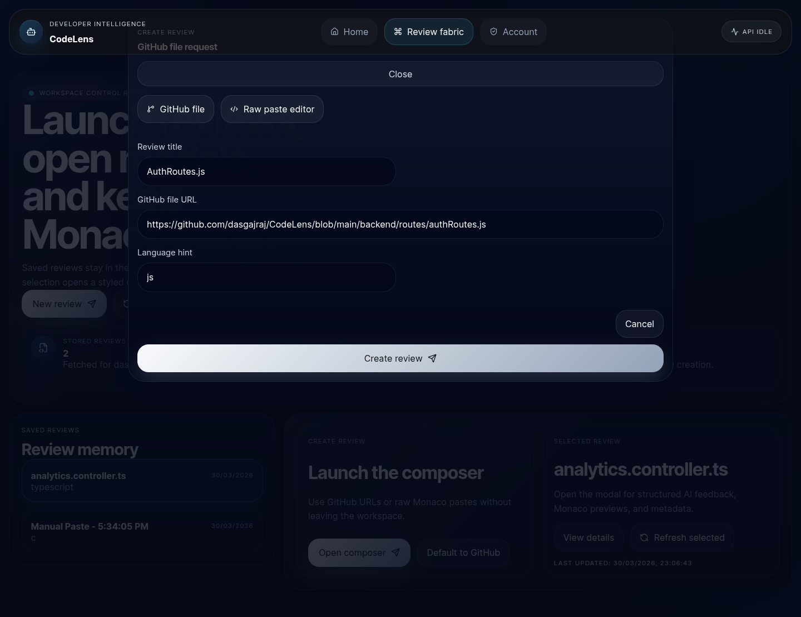
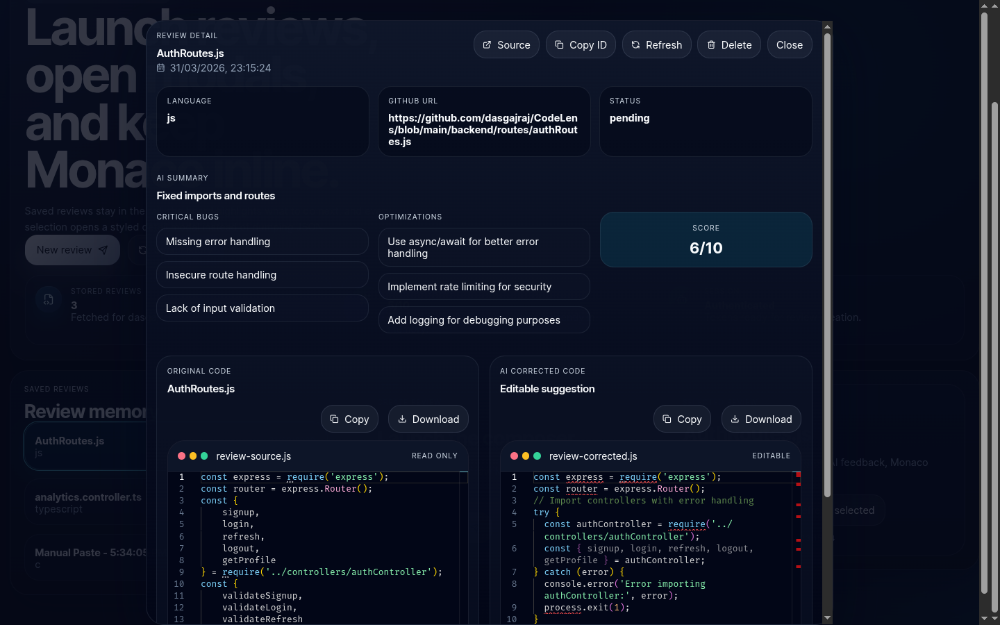

# CodeLens

A full-stack AI-assisted code review workspace that combines a React + Vite frontend with a Node/Express backend. Users can authenticate, submit snippets or GitHub files for review, inspect AI-generated feedback, and manage their personal workspace from desktop or mobile devices.

## What we have built so far

- **Authentication & session management** powered by JWT, Redux Toolkit, and persistence helpers to keep users signed in across reloads.
- **Workspace experience** with Monaco Editor panes that display original code and AI suggestions side-by-side for faster comparison.
- **Review pipeline** that stores submissions, normalizes review data, and calls Groq for structured summaries, bug reports, and corrected code.
- **Robust backend** featuring rate limiting, validation, detailed logging, and graceful shutdown handling, backed by MongoDB via Mongoose.
- **Reusable utilities** including error extraction helpers, local-storage persistence, and shared Monaco theme/options for consistent editing.

## UI/UX showcase

### Desktop view

**Unauthenticated flow**

| Loading Screen | Landing Page | Auth Page |
| --- | --- | --- |
|  |  |  |

**Authenticated workspace**

| Dashboard | Session Info |
| --- | --- |
|  |  |

**Adding a review**

| Submission modal | AI response summary |
| --- | --- |
|  |  |

### Desktop experience
- Split hero + board layout that highlights saved reviews, quick actions, and deep links into review modals.
- Dual Monaco editors inside the review detail modal so engineers can scan the original snippet and AI output in parallel.
- Smooth modal workflows for creating reviews, inspecting history, and copying/downloading corrected snippets.

### Mobile experience
- Responsive workspace grid collapses into stacked cards with thumb-friendly controls and large tap targets.
- Bottom-docked actions for creating reviews and refreshing history, ensuring core flows remain one-thumb accessible.
- Optimized typography and spacing to keep Monaco previews readable without horizontal scrolling.

## Project structure

```
CodeLens/
├── backend/          # Express + MongoDB API (auth, reviews, AI pipeline)
└── frontend/         # React + Vite SPA (workspace UI, Redux store)
```

Key frontend feature folders:
- `src/pages/UserPage.tsx`, `src/pages/WorkspacePage.tsx`: primary UX surfaces.
- `src/features/auth`, `src/features/reviews`: Redux slices + thunks for auth and review data.
- `src/services/api`: typed API clients (`authApi`, `reviewApi`, `authenticatedRequest`).
- `src/utils`: error handling, persistence, Monaco configuration, and review normalization helpers.

## Tech stack

**Frontend**
- React 18 + Vite + TypeScript for a fast SPA developer experience.
- Tailwind CSS + PostCSS for utility-first styling, with custom Monaco themes.
- Redux Toolkit with RTK Query-style thunks, persisting auth state via localStorage helpers.
- React Router and custom hooks (`useBackendWarmup`, typed `useAppSelector`/`useAppDispatch`).

**Backend**
- Node.js 20, Express 4, and Mongoose for REST APIs backed by MongoDB.
- JSON Web Tokens (JWT) for stateless auth, backed by hashed refresh-token rotation.
- Groq API integration for AI-powered review generation and normalization utilities.
- Robust middleware stack: Helmet-ready CORS, dual rate limiters, validation, and structured logging via Morgan.

**Data & Ops**
- MongoDB Atlas/local for persistence with dedicated `User`, `Review`, and `Comment` collections.
- npm scripts for dev/prod parity, plus health-check endpoint for container orchestrators.

## Getting started

### Prerequisites
- Node.js 20+
- npm 10+
- MongoDB instance (Atlas or local)
- Groq API key for AI-powered reviews

### Environment variables

Create `backend/.env`:
```
PORT=5000
HOST=0.0.0.0
MONGO_URI=mongodb://localhost:27017/codelens
JWT_SECRET=change-me
GROQ_API_KEY=your_groq_key
ALLOWED_ORIGIN=http://localhost:5173
```

Create `frontend/.env`:
```
VITE_API_URL=http://localhost:5000
```

### Install & run

```bash
# Backend
cd backend
npm install
npm run dev

# Frontend (new terminal)
cd frontend
npm install
npm run dev -- --host
```

Mobile devices on the same network can reach the app at `http://<your-ip>:5173` and backend at `http://<your-ip>:5000`.

## Backend endpoints

| Method | Endpoint             | Description | Auth required |
| ------ | -------------------- | ----------- | ------------- |
| POST | `/api/auth/signup` | Register a new user and persist hashed password. | No |
| POST | `/api/auth/login` | Exchange email/password for an access + refresh token pair. | No |
| POST | `/api/auth/refresh` | Rotate refresh tokens and issue a fresh access token. | Refresh token |
| POST | `/api/auth/logout` | Invalidate the provided refresh token hash. | Refresh token |
| GET | `/api/auth/me` | Return the authenticated user's profile and persisted sessions. | Bearer JWT |
| POST | `/api/reviews` | Submit inline code or a GitHub URL for AI review. | Bearer JWT + rate limited |
| GET | `/api/reviews/user` | List every review created by the current user. | Bearer JWT |
| GET | `/api/reviews/:id` | Retrieve a single review plus AI suggestions. | Bearer JWT |
| DELETE | `/api/reviews/:id` | Remove a review and its stored AI artifacts. | Bearer JWT |
| GET | `/health` | Lightweight uptime/status probe for infrastructure. | No |

## MongoDB data models

- **User**: name, unique email, bcrypt-hashed password, and an embedded array of refresh-token hashes with timestamps. Custom instance methods cover password comparison plus token rotation helpers (`addRefreshToken`, `removeRefreshToken`, `clearRefreshTokens`).
- **Review**: ties a user to a snippet (`title`, raw `code`, `language`) or optional `githubUrl`, tracks `status` (`pending` → `reviewed`), and stores the AI response payload inside `aiSuggestions` for quick retrieval.
- **Comment**: associates inline feedback with a review via `reviewId`, includes `lineNumber`, comment `text`, lightweight `author` tag, and a `resolved` switch to support future review threads.

## Next steps
- Expand automated testing across reducers, hooks, and API layers.
- Add screenshot assets to the UI/UX section and provide a live demo link.
- Introduce collaborative workspaces so teams can share review boards.

## Future updates: Phase 2 implementation

**Professional refinement (Phase 2)**
- Advanced code ingestion: GitHub App login with repo browser, multi-file context submissions, and drag/drop uploads backed by react-dropzone.
- Ultimate editor experience: Monaco Diff Editor with inline AI gutter widgets, contextual comments, and one-click "Fix It" merges.
- Backend hardening: BullMQ/Redis queues with Socket.io notifications, end-to-end schema validation (Zod/Joi), and structured JSON logging via Pino/Winston.

**SaaS roadmap**
- Team collaboration & social: shared org workspaces, threaded human + AI comment discussions, and shareable read-only review links.
- DevOps & CI/CD: CodeLens CLI, GitHub Actions integration that comments on PRs, and optional pre-commit hooks enforcing AI quality gates.
- AI intelligence upgrades: reviewer personas, opt-in local LLM (Ollama) support, and RAG-driven personalization using org knowledge bases.

**Basic vs. industry-level target**

| Capability | Basic (current) | Industry target |
| ---------- | --------------- | ---------------- |
| Auth | JWT in localStorage | HttpOnly cookies, fingerprinting, optional 2FA |
| Editor | Static Monaco view | Diff editor + inline actions |
| Reviews | Single file/URL | Repo context + branch analysis |
| API | Direct blocking calls | Queued jobs + WebSockets |
| Deployment | `npm run dev` | Docker, Kubernetes, CI/CD pipelines |
